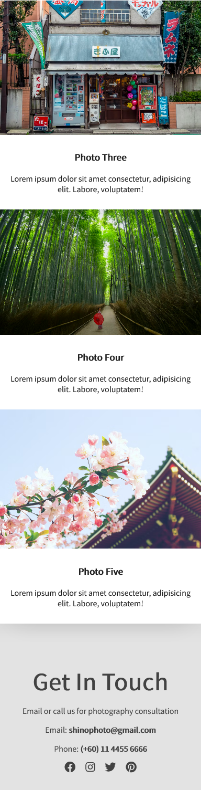

# Shino Photography Website

This is a small static web application project built to gain more experiences on front-end web designing and mobile-first approach responsive web designing. YouTube video is referenced to built the website to gain more insight of how a responsive website is built from scratch and how the concept of mobile first approach web design is implemented. 

The goal of the project is to understand and experience how people are building a responsive websites with mobile-first approach concept implemeneted and how is it important and preffered. 

## Sites
Live site to the portfolio: [https://hanz02.github.io/shino-photography/](https://hanz02.github.io/shino-photography/)

## Site Overviews
- Home Sections
  - Head Section (Desktop View)
    
  
  - Body & Footer
  
  

## References

The project website is built based of tutorial video on YouTube released by YouTube Channel named Traversy Media.

Please visit the [turorial video of Building Responsive, Mobile First Website](https://www.youtube.com/watch?v=XsEnj-1hG2o&t=1069s) by Traversy Media being referenced for this project website.\
More about Travery Media and his amazing tutorials, please visit [Traversy Media Youtube Channel]()
